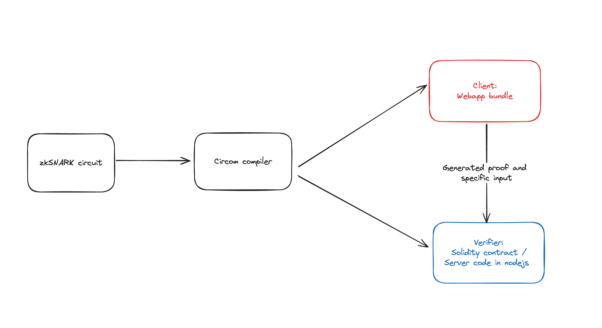
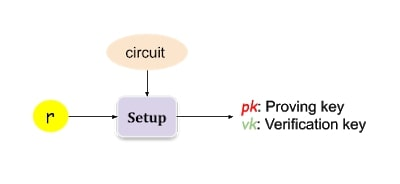
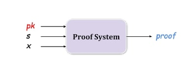
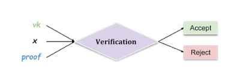
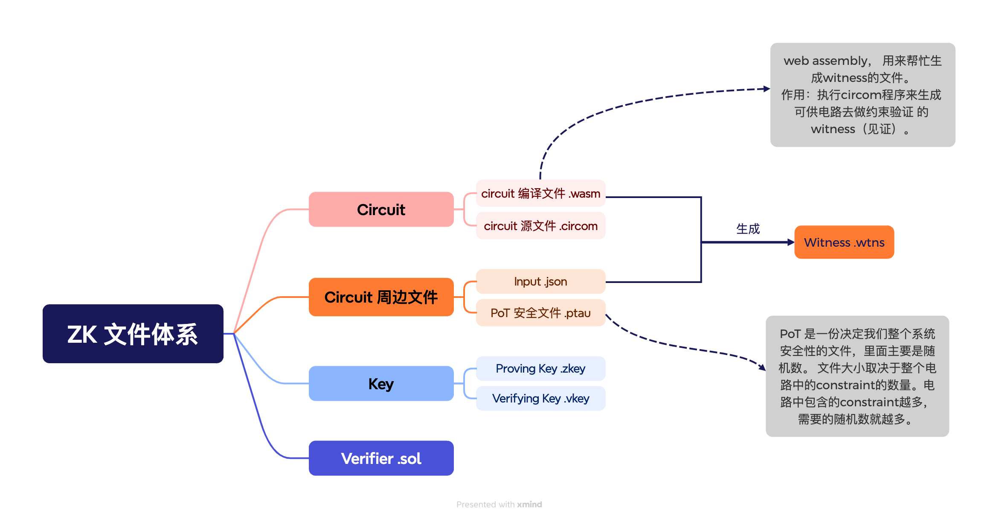
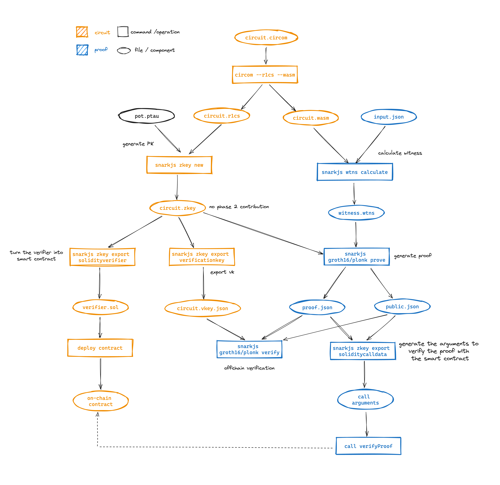

# ZK Dapp 开发入门手册 (zkSNARKs)

由于相较于普通的Dapp开发流程来说，ZK Dapp 在开发过程中引入了许多新的概念以及技术栈, 因此在上手尝试开发ZK Dapp的过程中，我决定整理记录下入门的过程以及遇到的坑，形成这一份开发入门手册，方便更多人上手。

## 常用技术 & 工具

- [snarkjs](https://github.com/iden3/snarkjs)
- [circom](https://docs.circom.io/circom-language/signals/)
- [zkREPL](https://zkrepl.dev/)
- [circomlib](https://github.com/iden3/circomlib/tree/master/circuits)
- [hardhat-circom](https://github.com/projectsophon/hardhat-circom)

## 整体流程

### ZK Dapp的基本结构

在一个Zk的体系中，我们有Prover 和 Verifier两个角色，如图，两个角色分别由我们Dapp的两个不同部分承担。无论是generate proof的prover还是 verify proof 的verifier， 他们都可以由我们写的circuit文件来生成。

### 基础流程

1. 初始化 & setup

在运行zk程序之前，我们需要创建一个可信的setup，而这需要一个circuit和一些随机数。完成setup后，我们会生成proving key(pk)和verifying key(vk)。

2. 生成proof

在zk中，我们根据需求，会有公开和私有两种输入，私有输入被我们叫做见证（witness）。想要生成proof，我们需要输入上一步生成的pk， 以及私有输入witness (s) 和 公开输入(x)。

3. 验证proof

Verifier使用公开输入，vk，和proof来验证证据。

### 文件体系

### snarkjs

在zk Dapp的开发中，最常用的工具就是 snarkjs。下图展现了在整个开发流程中你将如何使用 snarkjs. 你可以对照 [snarkjs 的官方文档](https://github.com/iden3/snarkjs?tab=readme-ov-file#guide) 和这张图来理解完整的流程。

## Reference

- snarkjs workflow, source: <https://github.com/iden3/snarkjs>
- 基础流程中的图， source: <https://github.com/LuozhuZhang/zkps-circuit-snark>
- [0xparc](https://learn.0xparc.org/materials/circom/learning-group-1/circom-1)
